# Sanitize NowPlaying for Stereo Tool

Lightweight PowerShell tool that cleans and normalizes nowplaying.txt metadata for reliable RDS RadioText (RT and RT+).

Designed for small and semi-professional FM stations that want clean, broadcast-ready RDS RadioText with minimal manual library tagging.

This project was created through iterative co-development with ChatGPT 5.2, combining AI-assisted development with hands-on design, testing, and optimizations.

# Features

- Real-time monitoring of nowplaying.txt from playout software, such as RadioBOSS and the like
- Intelligent cleanup of artist/title (removes encoders, bitrates, countries, platform tags, duplicate info, etc.)
- Smart handling of brackets, “feat.” and common metadata noise
- Adaptive trimming to the RDS 64-character limit with priority-based shortening for optimal readability
- Optional transliteration (Greek/Cyrillic) and ASCII-safe mode
- Clean output for RT and RT+ (artist/title tagging)
- Multilingual “Now playing” prefix
- Configurable (including custom) field delimiter
- Color console UI with status view and F10 settings menu
- Persistent JSON configuration and single-instance protection
- Runs on Windows 10/11 (script or standalone .exe)

# Usage

Save the standalone .exe (included in Sanitize-NowPlaying.zip) to any directory with write permissions and run it from there. The application stores its JSON settings file in the same location.
No PowerShell configuration is required.

When running on Windows 11, the application may open inside Windows Terminal tabs.  
For best compatibility, it is recommended to run it using the classic console host (conhost.exe). Create a shortcut and set the target to:

    conhost.exe "<full-path>\Sanitize-NowPlaying.exe"

Example:

    conhost.exe "C:\RDS\Sanitize-NowPlaying.exe"
 
Alternatively, you can run the script from a command prompt:

    PowerShell -NoProfile -ExecutionPolicy Bypass -File .\sanitize-nowplaying.ps1

You may first have to allow local scripts (one-time step): 
    
    PowerShell Set-ExecutionPolicy RemoteSigned -Scope CurrentUser
 
In your playout software, configure nowplaying.txt to be written to the selected working directory (e.g. C:\RDS).

Ensure that the field delimiter used between %artist and %title matches the delimiter configured in the F10 menu (Playout delimiter). The selected delimiter is automatically copied to the clipboard for convenience. For example, when the recommended "␟" character is used, the metadata setting in the playout software should be:

    "%artist␟%title"
Then configure Stereo Tool (or any other RDS encoder) to read from the sanitized output text file(s).

# Example screenshots

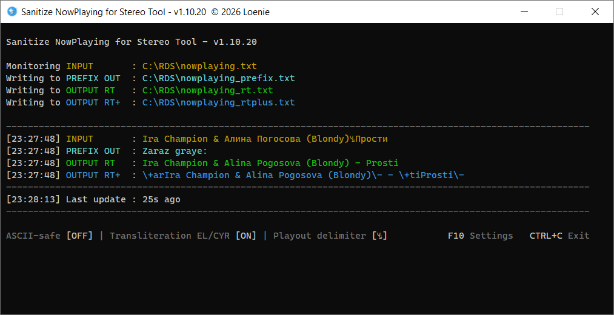

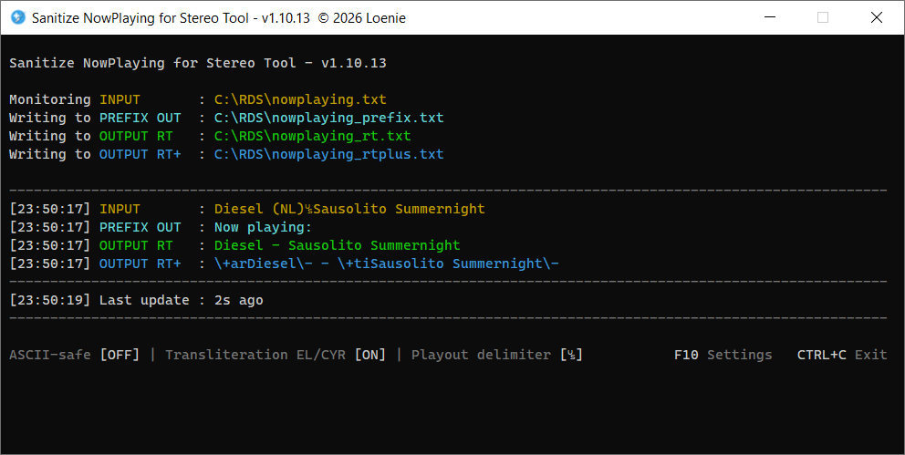

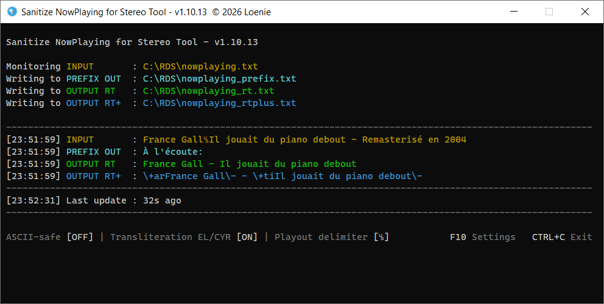

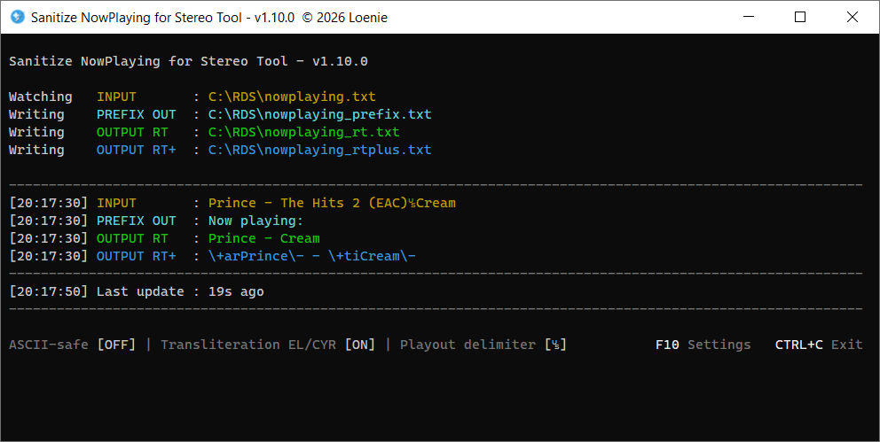

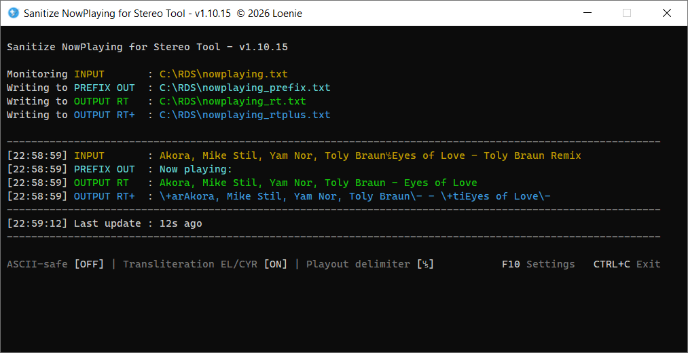

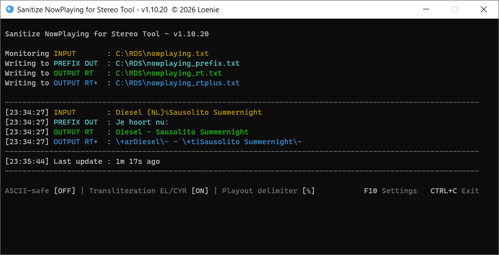

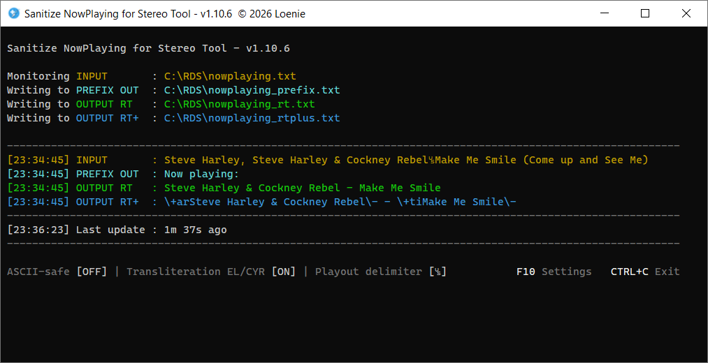

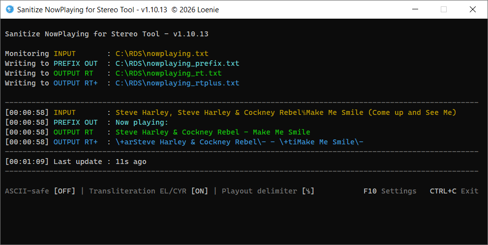

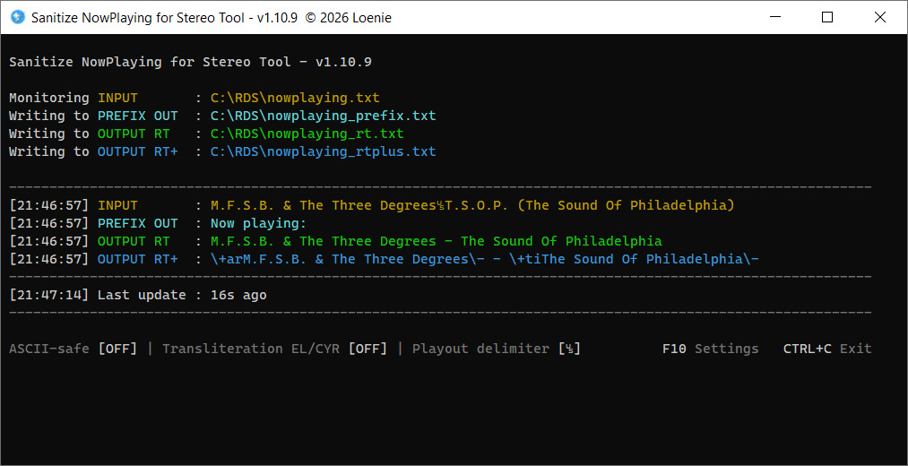

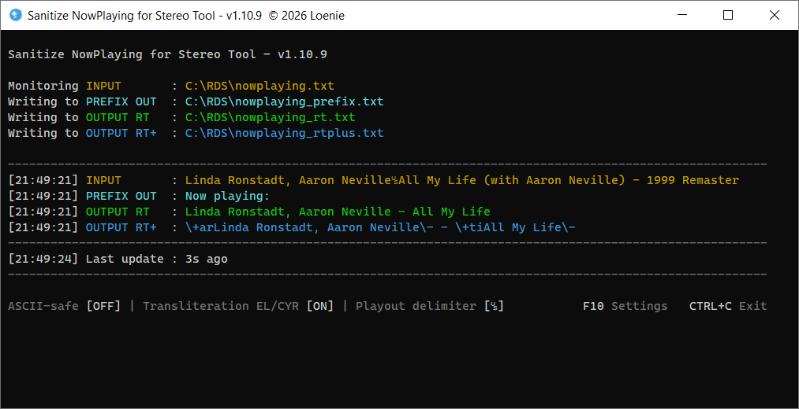

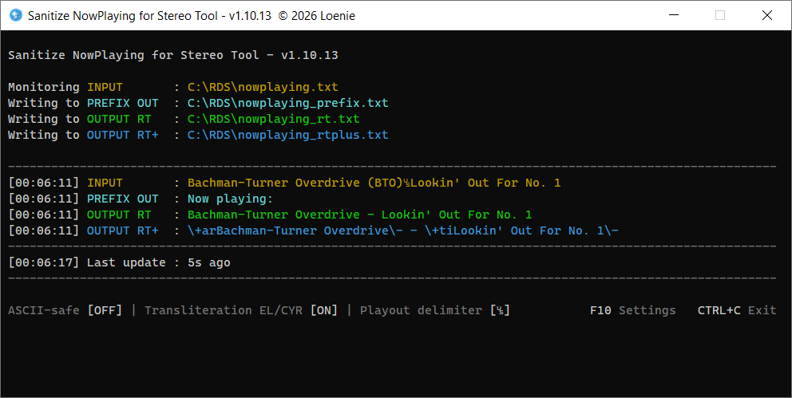

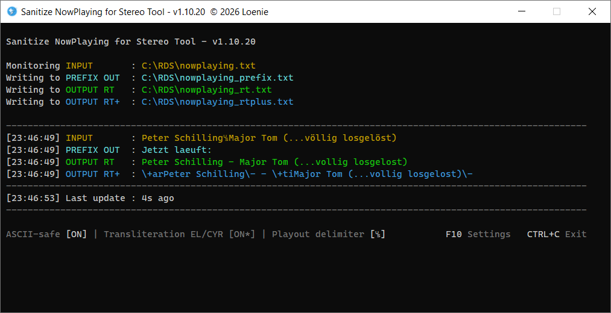

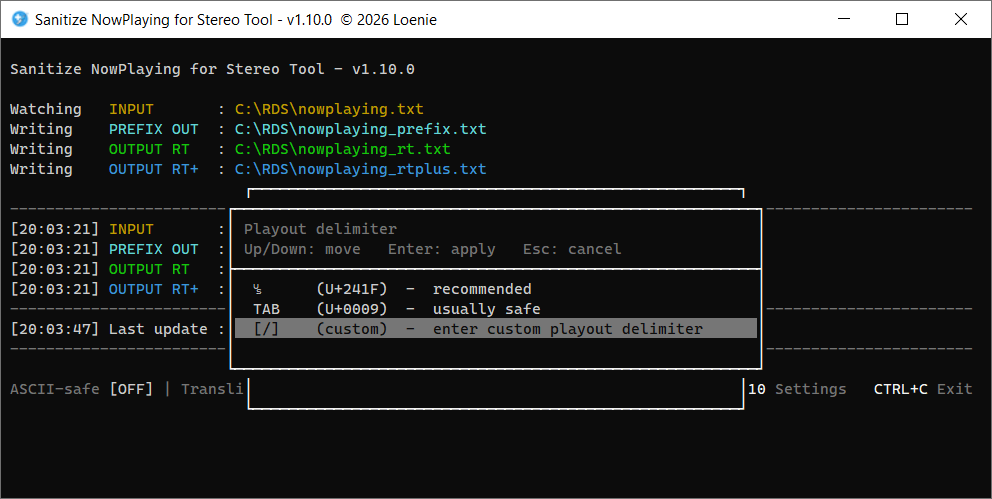

